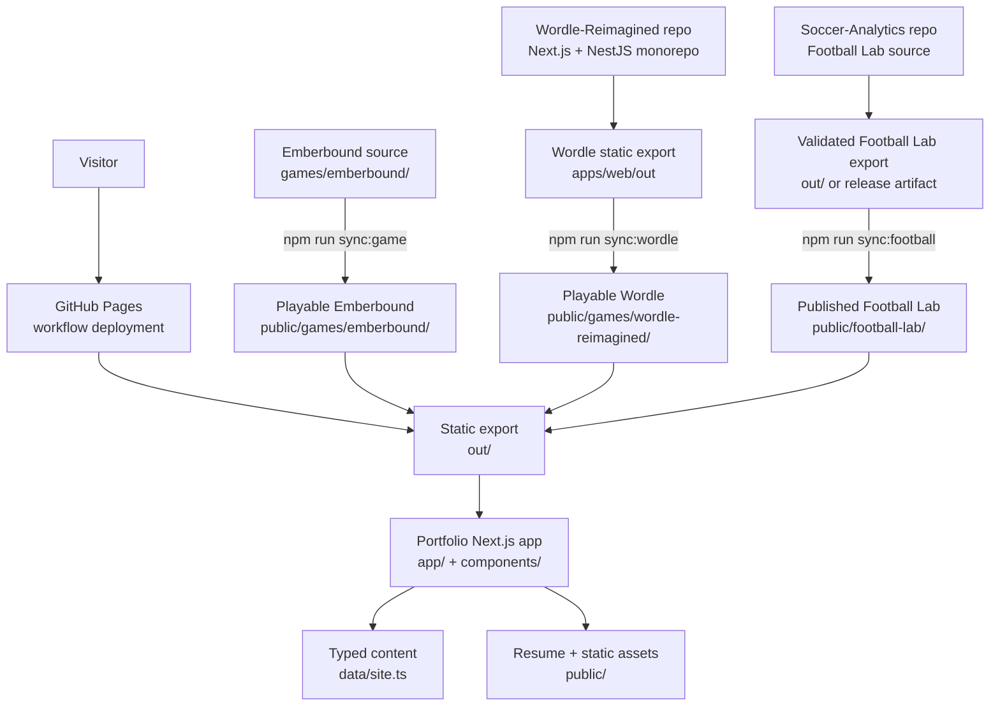

# Aniket Giriyalkar — Portfolio

A statically exported Next.js portfolio organized around software engineering,
data engineering and science, app development, and selected personal interests.
It also includes **Emberbound**, an original browser arcade game evolved from a
historical Python/Pygame training project, **Queens-Reimagined**, a deterministic
daily logic game, and **Wordle-Reimagined**, an
offline-first word game built in a separate Next.js/NestJS repository. The site
also includes a current resume download and links to the supporting project
repositories behind the portfolio.

The portfolio also publishes **Football Lab** at `/football-lab/`. Its source,
data ingestion, and analytics live in `aniketgiriyalkar/Soccer-Analytics`; this
repository vendors only the validated static artifact.

## Stack

- Next.js App Router with TypeScript
- Static export for GitHub Pages
- Content modeled in typed local data
- Dependency-free HTML Canvas game
- Vendored Wordle-Reimagined static artifact
- Vendored Queens-Reimagined static artifact
- Versioned Football Lab static artifact
- Node test runner for game rules and score persistence
- Resume and project links are served as static assets for GitHub Pages

## Page-by-page breakdown

| Route | Source | Purpose |
| --- | --- | --- |
| `/` | `app/page.tsx` + `data/site.ts` | Landing page with the hero, domain navigation, and featured work cards. |
| `/projects/` | `app/projects/page.tsx` + `components/ProjectCard.tsx` | Full project archive driven by the typed project list. |
| `/software-engineering/` | `app/software-engineering/page.tsx` | Domain page for backend, systems, APIs, and engineering-heavy projects. |
| `/data-engineering-science/` | `app/data-engineering-science/page.tsx` | Domain page for analytics, data engineering, modeling, and visualization work. |
| `/app-development/` | `app/app-development/page.tsx` | Domain page for web, mobile, and interactive application projects. |
| `/games/` | `app/games/page.tsx` | Game launcher for Queens-Reimagined, Wordle-Reimagined, and Emberbound, with links to play and inspect source repositories. |
| `/games/queens-reimagined/` | `public/games/queens-reimagined/` | Vendored static export from the separate `Daily-Games-Reimagined` repository. |
| `/games/wordle-reimagined/` | `public/games/wordle-reimagined/` | Vendored static export from the separate `Wordle-Reimagined` Next.js app. |
| `/games/emberbound/` | `games/emberbound/` synced to `public/games/emberbound/` | Browser arcade game source maintained inside this repo and copied into the public tree during dev/build. |
| `/football-lab/` | `public/football-lab/` | Vendored static artifact from the separate Soccer Analytics/Football Lab project. |
| `/about/` | `app/about/page.tsx` | Profile narrative and current positioning. |
| `/personal/` | `app/personal/page.tsx` | Personal interests and non-work placeholders. |
| `/contact/` | `app/contact/page.tsx` | Contact links, resume link, and social destinations. |

## Architecture



The portfolio itself is a static Next.js shell. The interactive experiences are
kept at clear boundaries: Emberbound source lives in this repository,
Wordle-Reimagined is built in its own repository and vendored as a static game,
and Football Lab is promoted as a validated static analytics artifact. GitHub
Actions validates the portfolio, builds `out/`, uploads it as a Pages artifact,
and deploys that artifact to `https://aniketgiriyalkar.github.io/`.

## Local Development

```bash
npm install
npm run dev
```

Open `http://localhost:3000`.

## Validation

```bash
npm run lint
npm run typecheck
npm test
npm run build
```

`npm run build` generates the deployable site in `out/`. The Emberbound source
lives in `games/emberbound/` and is synchronized to the public static tree by
the `predev` and `prebuild` hooks. Wordle-Reimagined is synchronized from a
separate static export when `WORDLE_REIMAGINED_OUT` points to its `apps/web/out`
directory, or from a sibling `Wordle-Reimagined/apps/web/out` directory when
present. Football Lab is synchronized from a sibling `Soccer-Analytics/out`
directory when present; otherwise the last-known-good vendored artifact is
preserved.

To import a promoted Football Lab release:

```bash
npm run sync:football -- --remote
```

## Content Updates

Portfolio projects, profile details, social links, experience, education, and
personal placeholders are defined in `data/site.ts`. Replace items marked as
placeholders when refreshed details are available.

The current public resume is stored at
`public/resume/Aniket-Giriyalkar-Resume.pdf`. Replacing that file preserves the
resume links used across the header, homepage, contact page, and footer.

## Linked Projects

The website points to a small collection of supporting repositories. Each one
describes a different part of the portfolio and can be modernized in a future
pass without changing the public site design.

- `Arcade_Game-Internshala-Certified-Python-Training-` - original Maryo/Pygame
  training project preserved as the historical baseline.
- `Wordle-Reimagined` - offline-first Next.js word game with an optional NestJS
  backend for daily puzzles and anonymous result stats.
- `Soccer-Analytics` - World Cup xG modeling and player analysis notebooks.
- `Orders_Microservice` - order-processing API with Sequelize and PostgreSQL.
- `Appointment-booking-management-system` - Vue appointment management app.
- `ShoppingCart` - Vue storefront with cart, filters, and routing.
- `login_flutter` - Flutter login/register prototype backed by PHP/MySQL.
- `Traffic-Alert-System-Using-VANET` - location-aware traffic alert project.
- `ARP-Spoof-Detection-Algorithm-Using-ICMP-Protocol` - network-security
  detection prototype based on the referenced paper.

## Suggested Revamps

If you revisit the remaining repositories, these are the most sensible upgrade
paths:

- Arcade game: `Phaser 3` or `TypeScript + Canvas` for a browser-first game.
- Soccer analytics: `Python + Polars + DuckDB + Streamlit` or `Quarto` for a
  more polished analytics experience.
- Orders microservice: `FastAPI` or `NestJS` with `Prisma`, Docker, and a
  cleaner OpenAPI-first contract.
- Vue booking and cart apps: `Vue 3 + TypeScript + Vite + Pinia`.
- Flutter login: `Flutter + Supabase` or `Flutter + Firebase Auth` instead of
  handwritten PHP session plumbing.
- Traffic alert system: `React Native` or `Flutter` with `PostGIS`-backed maps.
- ARP detection: a `Python + FastAPI` dashboard, or a `Go`/`Rust` agent with a
  web UI for real-time findings.

## Deployment

The GitHub Actions workflow builds and deploys `out/` to GitHub Pages. It also
checks the latest validated Football Lab release daily at 09:13 UTC, after the
upstream ingestion window, and preserves the last-known-good artifact if the
download or validation fails. This polling design requires no cross-repository
token. Pages is static hosting: a future shared Emberbound leaderboard must run
as a separately hosted API. The planned boundary is an asynchronous
score-provider interface, allowing a FastAPI/PostgreSQL adapter without
coupling database concerns to the game loop.

No secrets or database credentials are required by this project.
